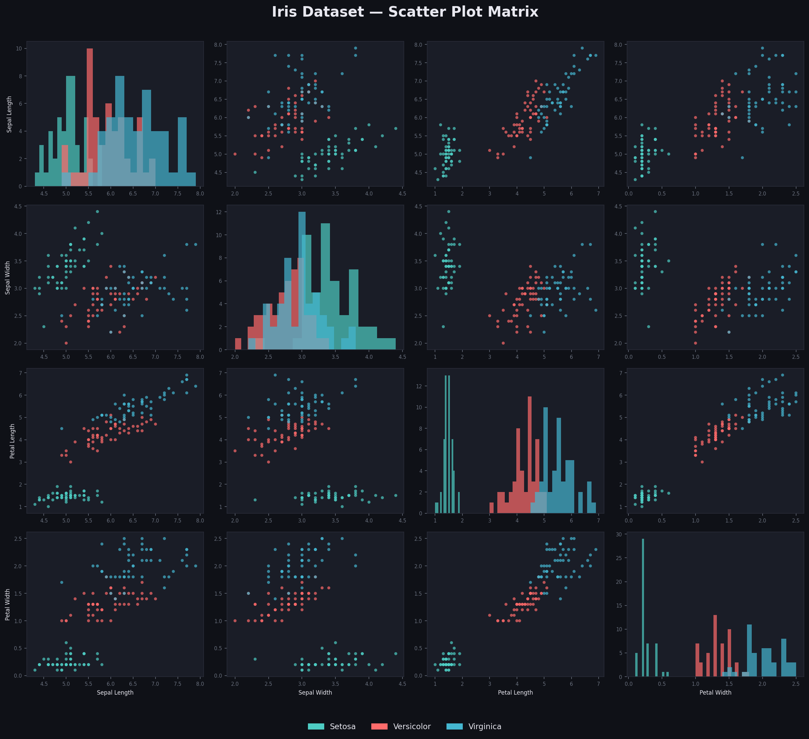
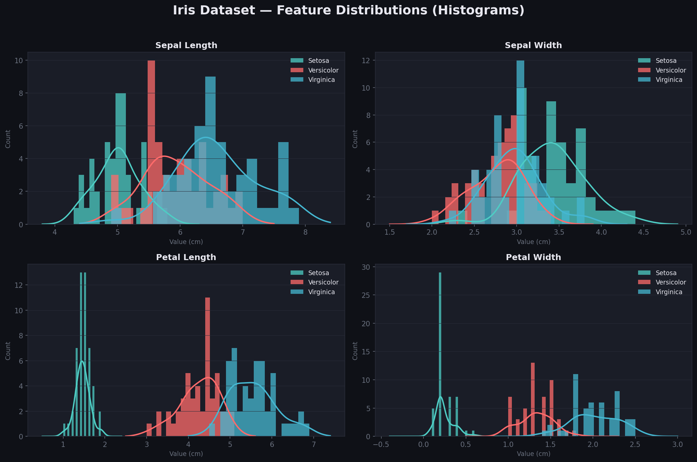
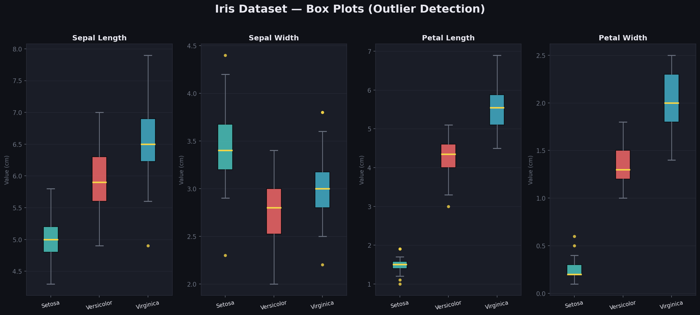

# 🤖 DevelopersHub Corp — AI/ML Internship Tasks

> A collection of hands-on machine learning tasks completed during the AI/ML Internship at **DevelopersHub Corp**.  
> Each task is fully documented with a Jupyter Notebook, clean code, and visual outputs.

---

## 📁 Repository Structure

```
ml-internship/
│
├── Task1_Iris_EDA/
│   ├── task1_iris_analysis.ipynb   ← Main notebook
│   ├── iris_analysis.py            ← Standalone Python script
│   ├── fig1_scatter_matrix.png     ← Scatter plot matrix
│   ├── fig2_histograms.png         ← Feature distributions
│   ├── fig3_boxplots.png           ← Box plots & outliers
│   └── README.md                   ← This file
│
└── (more tasks coming...)
```

---

## ✅ Task 1 — Exploring and Visualizing the Iris Dataset

### 🎯 Objective
Load, inspect, and visualize the Iris dataset to understand feature distributions,
pairwise relationships, and outliers using `pandas`, `matplotlib`, and `seaborn`.

### 📂 Dataset Used

| Property | Detail |
|---|---|
| **Name** | Iris Dataset |
| **Source** | `sklearn.datasets.load_iris()` |
| **Size** | 150 rows × 5 columns |
| **Features** | `sepal_length`, `sepal_width`, `petal_length`, `petal_width` |
| **Target** | `species` — Setosa, Versicolor, Virginica (50 each) |
| **Missing Values** | None |

### 🛠️ Libraries & Tools

```python
pandas       # Data loading, inspection, statistics
numpy        # Numerical operations
matplotlib   # Core plotting engine
seaborn      # High-level statistical visualization
scipy        # KDE smoothing on histograms
sklearn      # Dataset loading
```

### 📊 Visualizations Produced

| Plot | Purpose |
|---|---|
| **Scatter Plot Matrix (4×4)** | Pairwise relationships between all features |
| **Histograms (2×2)** | Distribution of each feature per species with KDE |
| **Box Plots (1×4)** | Spread, IQR, and outlier detection per feature |

### 🔍 Key Results & Findings

1. **Setosa is linearly separable** from Versicolor and Virginica across nearly
   all feature combinations — visible clearly in the scatter matrix.

2. **Petal Length & Petal Width** are the most discriminative features:
   - Setosa: petal length ≈ 1–2 cm
   - Versicolor: petal length ≈ 3–5 cm
   - Virginica: petal length ≈ 4.5–7 cm

3. **Sepal Width** has the most outliers (detected via box plots), particularly
   in the Setosa class.

4. **The dataset is perfectly balanced** — 50 samples per species — making it
   ideal for unbiased classification model training.

5. Versicolor and Virginica **overlap slightly** in sepal features, meaning
   a non-linear model would be needed to separate them perfectly.

### 📸 Preview

| Scatter Matrix | Histograms | Box Plots |
|---|---|---|
|  |  |  |

---

## 🚀 How to Run

```bash
# Clone this repo
git clone https://github.com/YOUR_USERNAME/ml-internship.git
cd ml-internship/Task1_Iris_EDA

# Install dependencies
pip install pandas numpy matplotlib seaborn scikit-learn scipy

# Run the notebook
jupyter notebook task1_iris_analysis.ipynb

# OR run the standalone script
python iris_analysis.py
```

---

## 👤 Author

**[Your Name]**  
AI/ML Intern @ DevelopersHub Corp  
Submitted via Google Classroom
